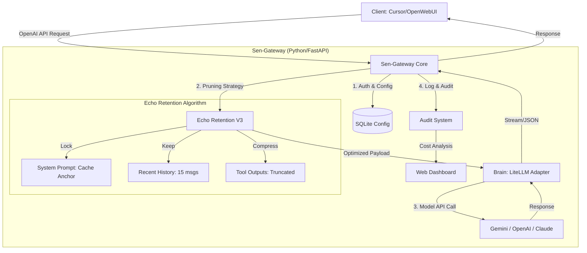

# Sen-Gateway 🚀

[中文版](README_ZH.md)

---

## 🌟 Introduction

**Sen-Gateway** is a high-performance, lightweight AI model gateway designed to optimize efficiency and cost for Large Language Models (LLMs), especially **Google Gemini**. It implements an OpenAI-compatible API interface and features the innovative **Echo Retention** context compression and audit mechanism.

### 📸 Preview


### 🧠 Core Features

- **Echo Retention (V3) Algorithm**: 
  - **Cache Anchor**: Locks the System Prompt to ensure maximum Prompt Caching hit rates (enjoy **0.1x** pricing).
  - **Role-Aware Compression**: Automatically trims redundant long-term tool outputs while preserving core assistant responses and recent memory, reducing Token consumption by **30%-80%** while maintaining intelligence.
- **Visual Audit Dashboard**: Real-time cost audit based on actual Gemini billing rules, displaying Token savings and cache benefits.
- **Unified Protocol Conversion**: Maps models from OpenAI, Anthropic, etc., to a unified OpenAI-compatible format for one-click distribution.
- **Dynamic Hot Configuration**: Switch models, configure API Keys, and proxy settings in real-time via Web UI without code changes.

### 🎨 Architecture Workflow



---

## 🛠️ Quick Start

### 1. Prerequisites
- **Python**: 3.9+
- **Network**: Ensure access to LLM APIs (or configure built-in proxy).

### 2. Installation
```bash
# Clone repository
git clone https://github.com/oneles/Sen-Gateway.git
cd Sen-Gateway

# Create & Activate Virtual Environment
python3 -m venv venv
source venv/bin/activate  # Linux/macOS

# Install Dependencies
pip install -r requirements.txt
```

### 3. Setup API Key
Create a `.env` file in the root directory:
```env
GEMINI_API_KEY=your_google_api_key
GEMINI_MODEL=gemini/gemini-2.5-flash
```

---

## 🚀 Run & Integrate

### 1. Start Service
```bash
python run.py
```
Default runs on `http://localhost:8000`.

### 2. Client Configuration (OpenClaw/Cursor)
Point your client to Sen-Gateway:
- **Base URL**: `http://localhost:8000/v1`
- **API Key**: `any` (Gateway uses your configured key automatically)

### 3. Access Dashboard
Visit: `http://localhost:8000/dashboard`
- **Default User**: `admin`
- **Default Password**: `88888888`
- **Features**: View interaction logs, run cost audits, modify system config.

---

## 📁 Project Structure

```text
Sen-Gateway/
├── app/                # Core Logic (FastAPI, Pruner, Brain)
├── scripts/            # Tools (Reset Password, DB Check)
├── run.py              # Entry Point
├── requirements.txt    # Dependencies
└── README.md           # Documentation
```

---

## 🛡️ Security
- Recommended: change default admin password via `scripts/reset_password.py`.
- `secret.key` is used for encrypting API Keys. Keep it safe.

---
*Developed by 森哥 (Senge) | Tech Core: Echo Retention (V3)*
