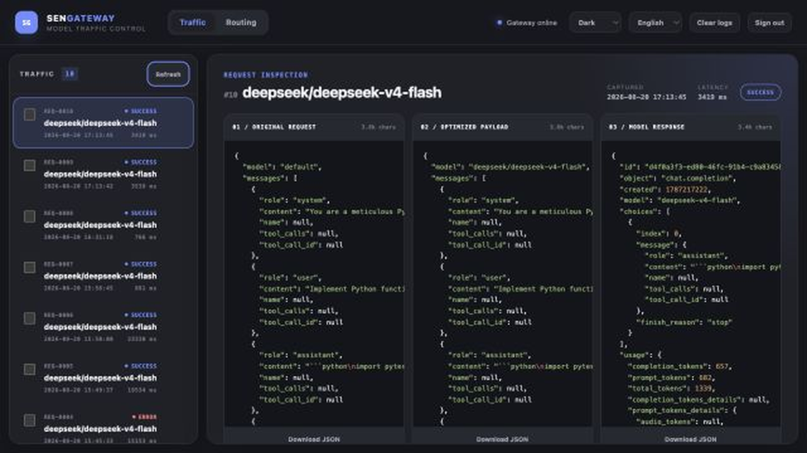
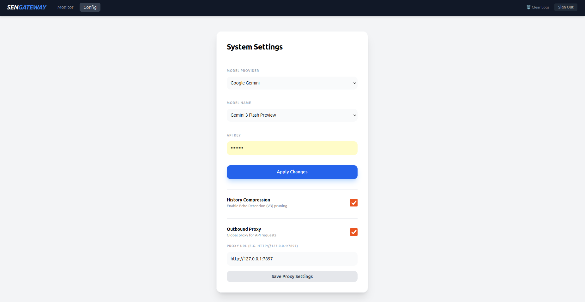

# Sen-Gateway 🚀 (Echo Retention V5)

[English Version](README.md)

---

## 🌟 简介

**Sen-Gateway** 是一款高性能、轻量的 AI 模型网关，专为优化大语言模型（LLM，特别是 **Google Gemini**）的效率和成本而设计。它实现了 OpenAI 兼容的 API 接口，并搭载了创新的 **Echo Retention** 上下文压缩与审计机制。

### 📸 预览




### 🧠 核心特性

- **Echo Retention (V5) 算法**: 
  - **工具感知剪枝 (Tool-Aware Pruning)**: 自动识别浏览器、终端日志、搜索结果等工具输出，进行语义级精简。
  - **多语言对齐**: 支持中英文双语剪枝标记，减少模型推理时的语境切换损耗。
  - **缓存锚点 (Cache Anchor)**: 锁定 System Prompt 以确保最高级别的 Prompt Caching 命中率（享受低至 **0.1x** 的计费）。
  - **角色感知压缩**: 自动精简冗余的长期工具输出，同时保留核心回复和近期记忆，Token 节省率可达 **20%-40%**。
- **可视化审计面板**: 基于 Gemini 实际计费规则进行实时成本审计，展示 Token 节省量和缓存收益。
- **统一协议转换**: 将 OpenAI、Anthropic、AWS Bedrock 等模型统一映射为 OpenAI 兼容格式。
- **动态热配置**: 无需重启，通过 Web UI 实时切换模型、配置 API Key 及代理设置。

---

## 💡 开发者建议：提示词注入 (Prompt Injection)

为了让大模型更好地理解 **Echo Retention (V5)** 的剪枝逻辑并减少推理幻觉，我们强烈建议在集成（如使用 OpenClaw、Cursor 或自定义应用）时，在 **System Prompt** 头部注入以下策略说明。

请根据你在 Sen-Gateway Dashboard 中设置的 **Language** 选项选择对应的提示词：

### 🇨🇳 中文提示词 (推荐)
> **[系统：Sen-Gateway V5 语义剪枝感知]**
> 当前会话已启用语义压缩。为了提升响应速度并降低延迟，系统已根据以下 **V5 剪枝策略** 对工具输出进行了精简：
> - **浏览器 (Browser)**: 仅保留具备 `ref` 句柄或交互角色（如按钮、输入框）的 UI 节点，剔除静态展示内容。
> - **终端日志 (Exec/Process)**: 仅保留首尾各 10/20 行，以及中间部分包含 `error|warning|failed|exception` 的关键行。
> - **结构化数据 (JSON)**: 对列表进行采样（保留前2项与最后1项），长字符串（>500 字符）会被截断展示。
> - **网页搜索 (Search)**: 仅保留相关度最高的前 5 条结果。
> - **长文本 (Fallback)**: 超过 1500 字符的文本仅保留首尾各 500 字符。
> 
> **提示**：如需获取被隐藏的完整细节，请明确要求“禁用剪枝重试”或“获取完整数据”。

### 🇺🇸 English Prompt
> **[System: Sen-Gateway V5 Semantic Pruning Awareness]**
> Context optimization is active. Tool outputs have been pruned using **Echo Retention (V5)** strategies to reduce latency:
> - **Browser**: Only interactive nodes (with `ref` or functional roles) are preserved.
> - **Exec Logs**: Middle segments are hidden; only HEAD/TAIL and lines containing `error|warning|failed|exception` are kept.
> - **Structured Data (JSON)**: Large arrays are sampled (First 2 + Last 1); strings longer than 500 chars are truncated.
> - **Search**: Only the top 5 results are shown.
> - **Long Text (Fallback)**: For text over 1500 chars, only the first and last 500 chars are preserved.
> 
> **Note**: If critical details are missing, explicitly request a "full-context" retry or specific filters.

---

## 🛠️ 快速开始

### 1. 环境要求
- **Python**: 3.9+
- **网络**: 确保可以访问 LLM API（或配置内置代理）。

### 2. 安装
```bash
# 克隆仓库
git clone https://github.com/oneles/Sen-Gateway.git
cd Sen-Gateway

# 创建并激活虚拟环境
python3 -m venv venv
source venv/bin/activate  # Linux/macOS

# 安装依赖
pip install -r requirements.txt
```

### 3. 配置 API Key
在根目录下创建 `.env` 文件：
```env
GEMINI_API_KEY=your_google_api_key
GEMINI_MODEL=gemini/gemini-2.5-flash
```

---

## 🚀 运行与集成

### 1. 启动服务
```bash
python run.py
```
默认运行在 `http://localhost:8000`。

### 2. 客户端配置 (OpenClaw/Cursor)

将客户端指向 Sen-Gateway。对于 **AWS Bedrock**，API Key 字段请使用 `AccessKey:SecretKey:Region` 格式。

### 3. 访问仪表盘
访问：`http://localhost:8000/dashboard`
- **默认用户**: `admin`
- **默认密码**: `88888888`
- **功能**: 查看交互日志、运行成本审计、修改系统配置（包括**语言切换**）。

---

## 💰 成本审计 (Audit System)
Dashboard 不仅仅是日志查看器，它还是你的 **Token 精算师**:
1. 在侧边栏选择多轮对话日志。
2. 点击 **🚀 Audit**。
3. 系统将基于实际计费规则计算成本：
   - **Token 统计**: 1 个中文字符 ≈ 2 tokens，4 个英文字符 ≈ 1 token。
   - **隐式缓存**: 自动检测轮次间的公共前缀，并应用 **0.1x - 0.25x (Prompt Caching)** 折扣率。
   - **效率分析**: 展示通过 Echo Retention 节省的实际费用。

---
*Developed by 森哥 (Senge) | Tech Core: Echo Retention (V5)*
