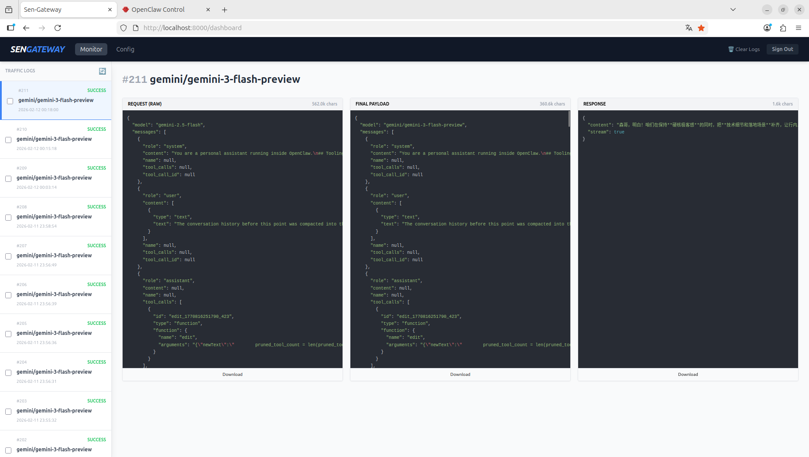
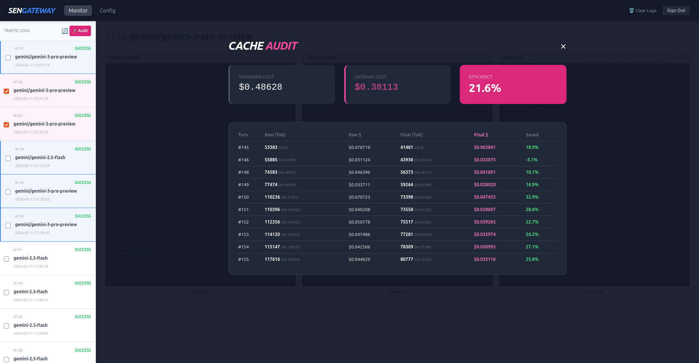
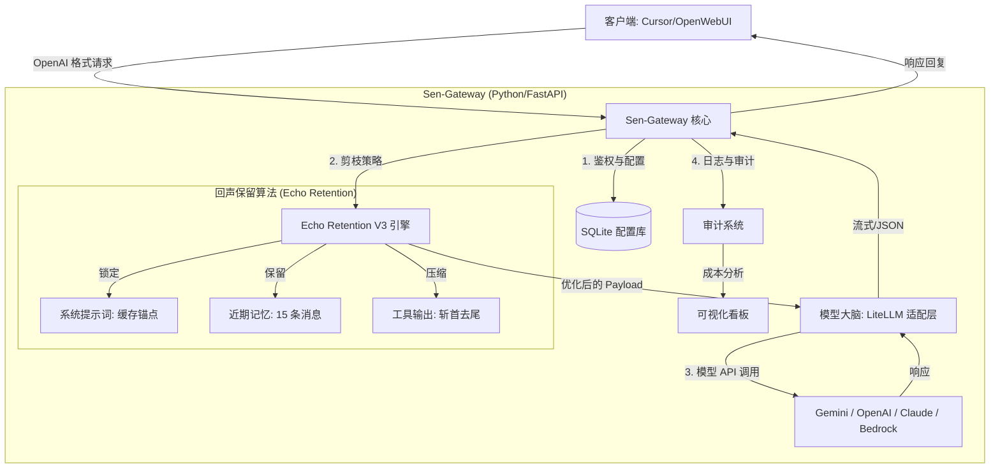

# Sen-Gateway 🚀 (中文版)

[English](README.md)

---

## 🌟 简介

**Sen-Gateway** 是一个高性能、轻量级的 AI 模型网关，专为提升大语言模型（尤其是 **Google Gemini** 和 **AWS Bedrock**）的效率与经济性而设计。它实现了 OpenAI 兼容的 API 接口，并内置了创新的 **Echo Retention (回声保留)** 上下文压缩与审计机制。

### 📸 界面预览

#### 1. 实时流量监控


#### 2. 深度成本审计与分析


#### 3. 高级模型管理 (自定义模型与 Bedrock 支持)


### 🧠 核心特性

- **Echo Retention (回声保留) V3 算法**: 
  - **Cache Anchor (缓存锚点)**: 锁定 System Prompt 和工具定义，确保极致的 Prompt Caching 命中率（享受 **0.1x** 计费）。
  - **角色感知压缩**: 自动精简远期冗余的工具输出，完整保留核心助手回复与近期记忆，在保持智商的前提下降低 **20%-30%** 的 Token 消耗。
- **可视化审计看板**: 基于真实 Gemini/Bedrock 计费规则的成本审计（Audit），实时展示 Token 节省率与缓存收益。
- **多协议统一转换**: 支持将 OpenAI, Anthropic 等模型统一映射为 OpenAI 兼容格式，一键分发。
- **动态热配置**: 运行中可通过 Web UI 实时切换模型、配置 API Key（包括 AWS Bedrock 凭证）及代理设置。

### 🎨 架构流程图



---

## 🛠️ 快速开始

### 1. 环境准备
- **Python**: 3.9+
- **网络**: 确保可以连接到大模型 API（或配置内置代理）

### 2. 安装与配置
```bash
# 克隆仓库
git clone https://github.com/oneles/Sen-Gateway.git
cd Sen-Gateway

# 创建并激活虚拟环境
python3 -m venv venv
source venv/bin/activate  # Linux/macOS
# Windows 使用: venv\Scripts\activate

# 安装依赖
pip install -r requirements.txt
```

### 3. 设置 API Key
在根目录下创建 `.env` 文件：
```env
GEMINI_API_KEY=你的谷歌API密钥
GEMINI_MODEL=gemini/gemini-2.5-flash
```

---

## 🚀 运行与集成

### 1. 启动服务
```bash
# 请务必在项目根目录下执行 run.py
python run.py
```
服务默认运行在 `http://localhost:8000`。

### 2. 在 OpenClaw/客户端中配置

将你的客户端（如 Cursor, OpenWebUI）指向 Sen-Gateway。对于 **AWS Bedrock**，请在 API Key 字段使用 `AccessKey:SecretKey:Region` 的格式。

以下是 **OpenClaw** 中的配置示例：

```json
"openai": {
  "baseUrl": "http://127.0.0.1:8000/v1",
  "apiKey": "sk-local",
  "api": "openai-completions",
  "models": [
    {
      "id": "gemini-2.5-flash",
      "name": "Sen Gemini 2.5 Flash",
      "input": ["text"],
      "contextWindow": 1000000,
      "maxTokens": 8192,
      "reasoning": false,
      "cost": { "input": 0, "output": 0, "cacheRead": 0, "cacheWrite": 0 }
    }
  ]
}
```

### 3. 访问看板 (Dashboard)
打开浏览器访问：`http://localhost:8000/dashboard`
- **默认账号**: `admin`
- **默认密码**: `88888888`
- **功能**: 查看交互详情、运行成本审计、修改系统配置。

---

## ⚡ 高级用法

### 🕵️ Agent 请求处理 (自动压缩)
Sen-Gateway 针对 **Agent 工作流**（如 Tool Use）进行了深度优化：
- 当 Agent 产生海量工具输出（如读取大文件、网页搜索结果）时，**Echo Retention** 算法会自动对远期消息执行“斩首去尾”压缩。
- 这种机制在防止上下文窗口爆炸的同时，能完美保留 Agent 的“思维链（CoT）”完整性。

### 💰 费率审计指南
内置 Dashboard 不仅仅是日志查看器，更是你的 **Token 精算师**：
1. 在侧边栏勾选多轮对话日志。
2. 点击 **🚀 Audit**。
3. 系统将基于以下规则精算成本：
   - **Token 估算**：中文 1 字 ≈ 2 Token，英文 4 字符 ≈ 1 Token。
   - **隐式缓存匹配**：自动对比前后轮次的前缀一致性，并应用 **0.1x - 0.25x (Prompt Caching)** 的缓存折扣率（参考 Google Gemini/Bedrock 真实规则）。
   - **效率对比**：直观展示 Echo Retention 策略相比“全量历史原始请求”为你省下了多少真金白银。

---

## 📁 目录结构

```text
Sen-Gateway/
├── app/                # 核心业务逻辑 (FastAPI, 剪枝算法, 模型适配)
├── scripts/            # 工具脚本 (密码重置、数据库检查、压力测试)
├── run.py              # 服务启动入口
├── requirements.txt    # 项目依赖清单
└── README.md           # 使用说明
```

---

## 🛡️ 安全提示
- 生产环境建议通过 `scripts/reset_password.py` 修改默认管理员密码。
- `secret.key` 用于加密存储 API Key，请妥善保管。

---
*Developed by 森哥 (Senge) | 技术核心：Echo Retention (V3)*
